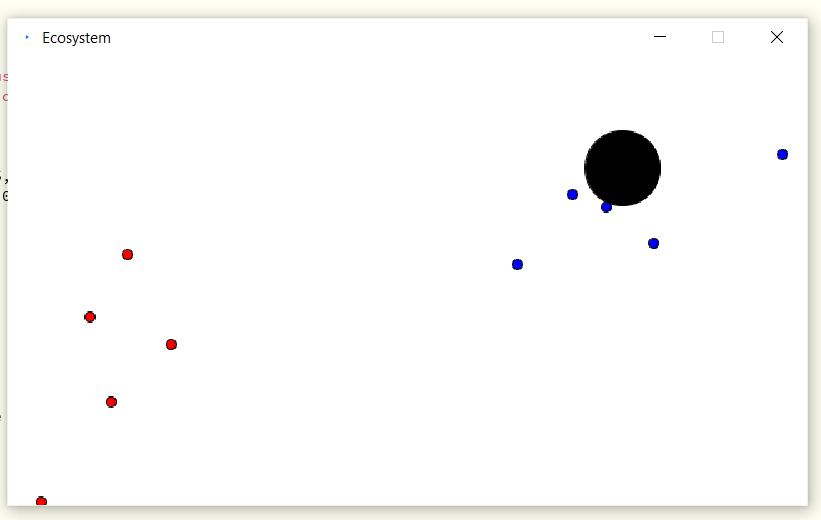
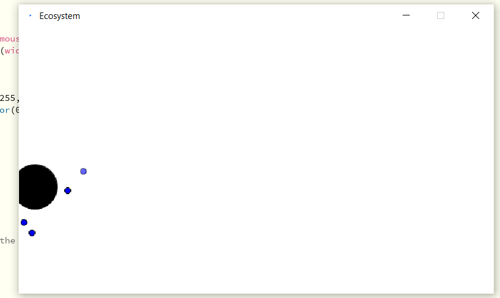

# Ecosystem

## Description 
There are a lot of preys which are the start of the food chain and are very weak. I thought from their perspective, as they are very weak and vulnerable to protect themselves they are terrified of the other creatures or animals in the food chain too. So, I thought of two organisms which are at the very bottom of the food chain and are always considered as the prey. The feeling both will have is to move away from each other in order to save themseleves. 

The red organisms are attracted to the cursor on the basis of its hunger level and it loses more lifespan compared to the blue organisms. The blue organisms attract towards a food source which appears on the screen randomly. It moves towards the source again according to its hunger level. 

## Evidences

## Problems and Solution
There was one problem of get different colour animals or organisms to repel each other. However, I was able to overcome the situation by getting help from Daniel Shiffman's book. The problem was solved by making different objects and changing its functions in the mover class. 

## Learning Outcomes 
It was a great experience of working with new concepts of forces and lifespan. I know processing but never worked with these concepts and it was intriguing to learn and test them myself. 

## Video Link
[]

