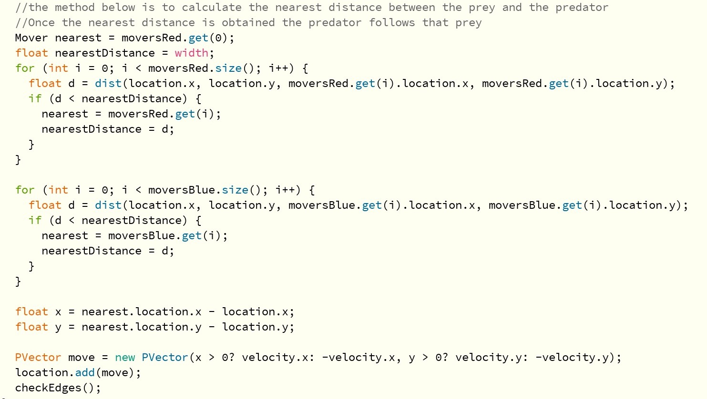
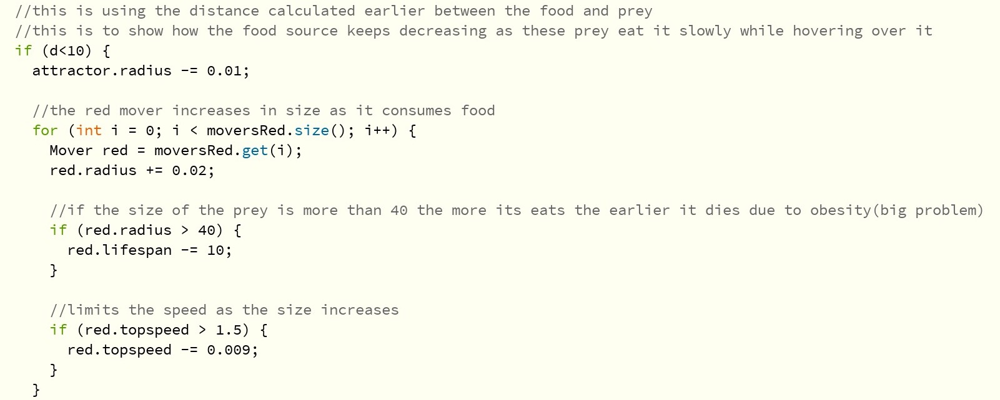
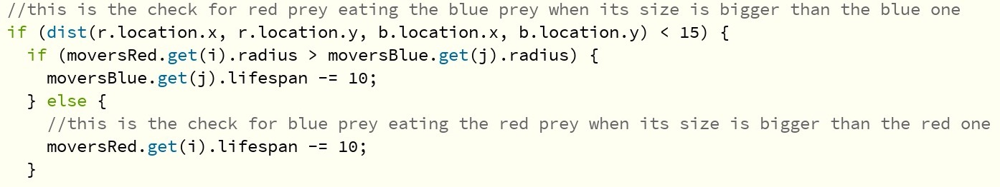
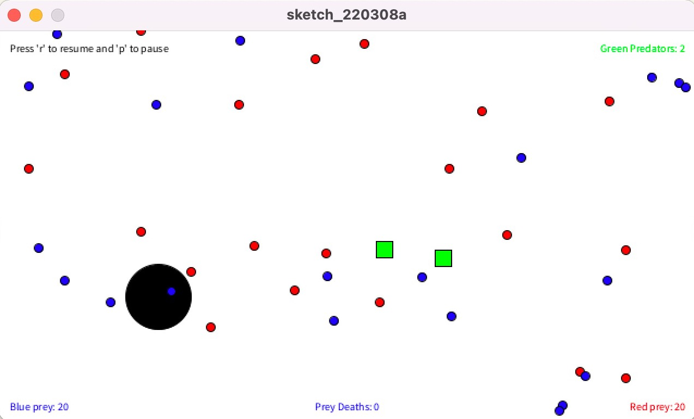
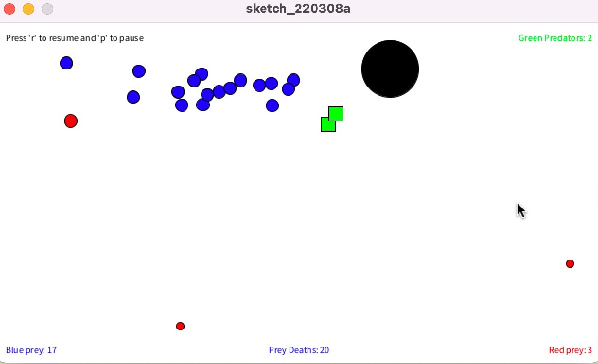

# Ecosystem (Midterm)

## Old Description 

There are a lot of preys which are the start of the food chain and are very weak. I thought from their perspective, as they are very weak and vulnerable to protect themselves they are terrified of the other creatures or animals in the food chain too. So, I thought of two organisms which are at the very bottom of the food chain and are always considered as the prey. The feeling both will have is to move away from each other in order to save themseleves. 

The red organisms are attracted to the cursor on the basis of its hunger level and it loses more lifespan compared to the blue organisms. The blue organisms attract towards a food source which appears on the screen randomly. It moves towards the source again according to its hunger level. 

## New Description (Rough Idea)

The concept in the old description will be groundwork for the new ecosystem that I will make. The are a lot of changes that I would like to do in my ecosystem. 
1. Different sizes for different creatures
2. Different level of max speed
3. On screen text to indicate which color represents which animal
4. On screen text to show hunger level or lifespan
5. Add a predator and may eat both the prey and grow bigger?
6. DNA's affect the behaviour of each creature

## Final Description 

I have a new perspective towards the ecosystem. There might be preys in the food chain that are too weak and vulnerable to defend themselves from strong predators that are higher in the food chain. In my previous ecosystem, I showed that these preys will be terrified from each other thinking that the other is stronger. However, now they move in cohesion towards the food source. As they are same types of species but different characteristics. They feed on the same source and each prey grows differently. If one prey is bigger (size) than the other prey then it will consume the prey as it consumes the food. So the prey will lose its lifespan rather than vanishing at once. This is implemented because these preys (blue and red) both take time to consume the food source rather than finishing it once.

### Characteristics of the Preys
1. Different level of max speed depending on the size. Size is inversely proportional to the speed.
2. Different lifespans, even the members of same type (red or blue) do not have the same lifespan. 
3. Different sizes for different creatures depending on how much food they consumed. 
4. Afraid of the predator and would try to run away from it. 
5. Lifespan decreases if the creature is not near the food source. 
6. If the creature collides with the wall then its speed is decreased.

## Code Snippets
#### Snippet 1 

The first two for loops are for finding nearest distance between the blue or the red prey. As there are many objects of both blue and red preys there is a for loop to to update the nearest value everytime a prey is near the predator. Then after the loops there is a definite nearest value that is obtained. So from that location of the prey(for which the nearest distance was achieved) and the location of predator the distance is calculated and then the directional vector. This directional vector is used in the velocity function of the predator so that it will follow the prey which is near to it every frame. 

#### Snippet 2

This code is about if the prey is within 10units from the food source then it consumes the food. Therefore, the radius of the food source is reduced to show how the food is finishing slowly by these creatures. Also these creature gain more mass after eating the food and their size also increases. When their size increases their speed is also decreased accordingly. To showcase the hunger level. If they arent hungry enough they will not be attracted by the food source like the smaller preys. 

#### Snippet 3 

This is a very interesting feature where one prey eats the other prey when its size is bigger than the other. However, it does not finish it at once like the predator. It finishes the prey like how they eats its food. So the lifespan decreases as the bigger size prey eats the other smaller size prey. 

## Evidence

#### Evidence 1 

This is the initial stage when you start the ecosystem. Everytime you start the location of every object will be different. This is because as nothing in the ecosystem can be predictable. 

#### Evidence 2

This image is important to show different operations that are working properly. At the bottom the stats shows that there are 17 of Blue preys left and only 3 of Red preys left in the ecosystem as of that moment or in that particular frame. So the number of preys left in total is 20. Also, the text shows that 20 have already died. In evidence 1 it was seen that there were 20 preys each making it 40 preys in total. So the count function of the ecosystem is working properly. 

## Difficulties 
The major difficulty was to determine which prey is near the predator so that the predator can follow that prey. So the problem was to first figure out what directional velocity the predator should have. The thinking was that it should be similar to that of the prey but that did not work out. However when I figured out the directional vector which could be used as the velocity vector too, the problem was that the first prey which was near the prey was always followed and the predator ignored the other preys. So I started the loop and called the function every frame for both blue preys and red preys. The loop helped me to trace the movement of the predator. However, I was still not sure if the nearest prey or target prey is changing so I changed the colour of the nearest prey to purple to see if all the preys that come close to the predator their colour changes. Thats was a very effective and unique way to debug my problem. 

## Further Development 
The further development in my ecosystem could be adding mutation or reproduction between red and blue prey. Also, it is very difficult but if the preys could lure the predator away from their food source would be effective. So if bigger preys who have less lifespan should sacrifice for the new preys. 

## Learning Outcomes 
It was a great experience of working with new concepts of vectors and DNA characteristics. I know processing but never worked with these concepts and it was intriguing to learn and test them myself. One learns new things everyday and I made my own way debugging style to solve some problems in the functions. Although, I did not use all kinds or characteristics that were taught in the class. I did practice them separately apart from the project to learn new skills and concepts. 

## Video Link
[![Ecosystem]](Evidence1.jpg)(https://youtu.be/toqvijvLLVM)
